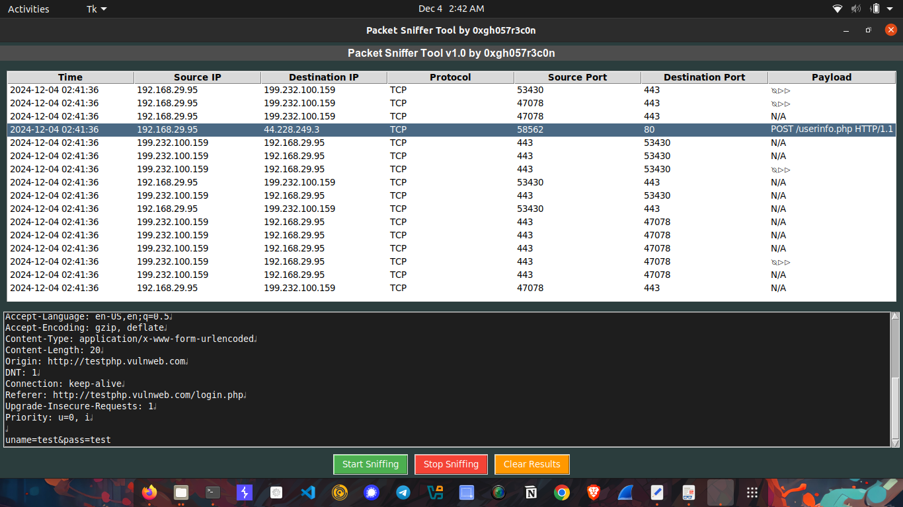

# Packet Sniffer Tool by 0xgh057r3c0n

**Version 1.0**

A GUI-based packet sniffer tool that captures and displays network packets in real-time. Built with Python3 using `tkinter` for the user interface and `scapy` for packet sniffing.

---

## Features
- **Real-Time Packet Capturing**: Sniffs `IP`, `TCP`, `UDP`, `ARP`, and `ICMP` packets.
- **User-Friendly Interface**: Interactive GUI to display captured packets and view detailed information.
- **Packet Details**: Displays source/destination IP, ports, protocol type, and payload data.
- **Control Buttons**:
  - **Start Sniffing**: Begin capturing network packets.
  - **Stop Sniffing**: Halt packet capture.
  - **Clear Results**: Clear the packet list and details view.

---

## Requirements

### Operating System
- Linux, macOS, or Windows (packet sniffing may require administrative privileges).

### Software
- **Python 3.x** (tested with Python 3.6+)
- **Dependencies**:
  - `tkinter` (comes with Python)
  - `scapy` (install via pip)

---

## Installation

1. Clone this repository or download the script:
   ```bash
   git clone https://github.com/0xgh057r3c0n/CodeAlpha_Network_Sniffer.git
   cd network-sniffer-tool
   ```

2. Install required Python modules:
   ```bash
   pip install scapy
   ```

---

## Usage

1. Run the script with Python 3:
   ```bash
   sudo python3 network_sniffer.py
   ```
   **Note**: Administrative/root privileges are often required for packet sniffing.

2. Use the GUI:
   - Click **Start Sniffing** to begin capturing packets.
   - Double-click a packet in the table to view detailed information.
   - Use **Stop Sniffing** to halt capturing.
   - Use **Clear Results** to reset the display.

---

## Screenshots
**Main Interface**  


---

## Known Issues and Limitations
- Capturing may require administrative privileges (`sudo`).
- High traffic environments may affect performance.
- Only supports basic protocols (`IP`, `TCP`, `UDP`, `ARP`, `ICMP`) at this stage.

---

## Contributing
Feel free to fork this repository, make enhancements, and submit a pull request. Contributions are welcome!

---

## License
This project is licensed under the GNU General Public License v3.0 License. See the LICENSE file for details.

---

## Disclaimer
This tool is for educational and ethical purposes only. Unauthorized use to intercept or analyze network traffic may violate local laws and regulations.

---

**Developed by 0xgh057r3c0n**
